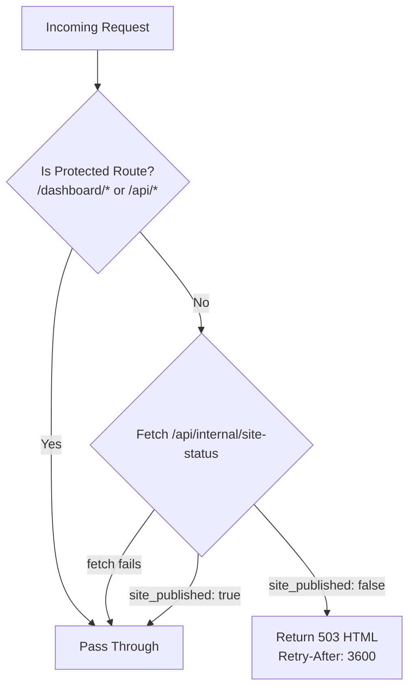

# Design Document: Maintenance Mode

## Overview

This feature adds a site-wide maintenance mode controlled by a `site_published` boolean flag stored in the `site_settings` SQLite table. When the flag is `false`, all public routes (`/`, `/blog/*`, `/affiliate/*`) return an HTTP 503 response with a self-contained branded HTML page. The dashboard and all API routes remain accessible at all times.

The key architectural constraint is that Next.js middleware runs on the **Edge Runtime**, which cannot load Node.js native modules like `better-sqlite3`. The middleware therefore reads the flag via a lightweight internal API route (`/api/internal/site-status`) that runs on the Node.js runtime and has direct DB access.

### Key Design Decisions

- **Internal API route over direct DB access in middleware**: Edge Runtime cannot use `better-sqlite3`. A dedicated `GET /api/internal/site-status` route (Node.js runtime, no auth required, read-only) bridges the gap. The middleware calls this via `fetch()` on every public request.
- **Self-contained 503 HTML**: Since middleware cannot import React components, the maintenance page is a template string with inline CSS using CSS custom properties matching the existing dark theme.
- **Preserve-if-absent pattern**: The `site_published` field in the settings API follows the same pattern as `page_blog_enabled` and `page_affiliate_enabled` — if absent from the PUT body, the existing value is preserved.
- **Idempotent migration**: The `site_published` column is added via the existing `runMigrations` pattern in `lib/db/migrations.ts`.

---

## Architecture

```mermaid
sequenceDiagram
    participant Visitor
    participant Middleware (Edge)
    participant /api/internal/site-status (Node.js)
    participant SQLite DB

    Visitor->>Middleware (Edge): GET /blog/some-post
    Middleware (Edge)->>+/api/internal/site-status (Node.js): fetch() GET
    /api/internal/site-status (Node.js)->>SQLite DB: SELECT site_published, telegram_url
    SQLite DB-->/api/internal/site-status (Node.js): { site_published: false, telegram_url: "..." }
    /api/internal/site-status (Node.js)-->>-Middleware (Edge): 200 { site_published: false, telegram_url: "..." }
    Middleware (Edge)->>Visitor: 503 HTML (Retry-After: 3600)
```



---

## Components and Interfaces

### 1. DB Migration (`lib/db/migrations.ts`)

Add an idempotent migration for the `site_published` column, following the existing pattern:

```typescript
if (!names.has("site_published")) {
  sqlite.exec(
    "ALTER TABLE site_settings ADD COLUMN site_published INTEGER NOT NULL DEFAULT 1"
  )
}
```

### 2. Drizzle Schema (`lib/db/schema.ts`)

Add to `tableSiteSettings`:

```typescript
site_published: integer("site_published", { mode: "boolean" }).default(true),
```

### 3. Internal Status API Route (`app/api/internal/site-status/route.ts`)

- Runtime: `nodejs`
- Method: `GET` only
- No authentication required (read-only, no sensitive data)
- Reads `site_published` from `site_settings` (defaults to `true` if no row)
- Reads `telegram_url` from `contacts` where `scope = 'landing'` (null if absent)
- Response shape: `{ site_published: boolean, telegram_url: string | null }`

```typescript
export const runtime = "nodejs"

export async function GET() {
  const db = getDb()
  const settings = db.select().from(tableSiteSettings).limit(1).all()[0]
  const contact = db
    .select()
    .from(tableContacts)
    .where(eq(tableContacts.scope, "landing"))
    .limit(1)
    .all()[0]

  return NextResponse.json({
    site_published: settings?.site_published ?? true,
    telegram_url: contact?.telegram_url ?? null,
  })
}
```

### 4. Middleware (`middleware.ts`)

Updated to intercept public routes and check the maintenance flag:

```typescript
export const config = {
  matcher: ["/dashboard/:path*", "/", "/blog/:path*", "/affiliate/:path*"],
}
```

Logic:
1. If the path starts with `/dashboard` or `/api`, pass through (existing auth logic for dashboard).
2. For all other matched paths (public routes), `fetch()` the internal status route.
3. If fetch fails or `site_published` is `true`, pass through.
4. If `site_published` is `false`, return `new Response(maintenanceHtml(telegramUrl), { status: 503, headers: { 'Retry-After': '3600', 'Content-Type': 'text/html' } })`.

### 5. Maintenance Page HTML Template

A pure function `maintenanceHtml(telegramUrl: string | null): string` that returns a self-contained HTML string:

- Dark background using `#0A0A0F` (hardcoded fallback + CSS variable `var(--background)`)
- Centered content (flexbox, full viewport height)
- Logo: ``
- H1: "Сайт временно недоступен"
- P: "Site temporarily unavailable"
- Optional Telegram button (only rendered when `telegramUrl` is non-null)
- Inline `<style>` block using CSS custom properties matching `app/globals.css`
- No external stylesheet links, no JavaScript

### 6. Settings API (`app/api/site/settings/route.ts`)

Add `site_published?: boolean | null` to `SiteSettingsPayload`. Follow the preserve-if-absent pattern:

```typescript
site_published:
  typeof body.site_published === "boolean"
    ? body.site_published
    : currentSitePublished,
```

Include `site_published` in both `updateValues` and the `insert` fallback values.

### 7. SiteSettingsEditor (`components/dashboard/SiteSettingsEditor.tsx`)

- Add `sitePublished` state: `const [sitePublished, setSitePublished] = useState(true)`
- Load from API: `const sitePublishedValue = data?.site_published ?? true`
- Include in PUT body: `site_published: sitePublished`
- Add to `initialSettings` type and object
- Add Switch toggle in the "Видимость страниц" card, grouped with `pageBlogEnabled` / `pageAffiliateEnabled`:
  - Label: "Сайт опубликован"
  - When OFF: show a warning description (e.g. "Сайт в режиме обслуживания — публичные страницы недоступны")

---

## Data Models

### `site_settings` table (updated)

| Column | Type | Default | Notes |
|--------|------|---------|-------|
| `site_published` | `INTEGER` (boolean) | `1` (true) | New column. `false` = maintenance mode active |

### Internal API response

```typescript
type SiteStatusResponse = {
  site_published: boolean
  telegram_url: string | null
}
```

### Settings API payload (updated)

```typescript
type SiteSettingsPayload = {
  // ... existing fields ...
  site_published?: boolean | null  // new
}
```

---

## Correctness Properties

*A property is a characteristic or behavior that should hold true across all valid executions of a system — essentially, a formal statement about what the system should do. Properties serve as the bridge between human-readable specifications and machine-verifiable correctness guarantees.*

### Property 1: Migration idempotency

*For any* SQLite database state (whether `site_published` column is present or absent), running `runMigrations` should result in the column existing, and running it a second time should not throw an error.

**Validates: Requirements 1.2**

### Property 2: Middleware blocks all public routes when unpublished

*For any* request path matching the public route patterns (`/`, `/blog/*`, `/affiliate/*`), when `site_published` is `false`, the middleware SHALL return a response with status `503` and a `Retry-After: 3600` header.

**Validates: Requirements 2.1, 2.4**

### Property 3: Middleware passes all protected routes regardless of flag

*For any* request path matching `/dashboard/*` or `/api/*`, regardless of the `site_published` value (true or false), the middleware SHALL pass the request through without returning a 503.

**Validates: Requirements 2.2**

### Property 4: Maintenance HTML conditionally includes Telegram link

*For any* `telegram_url` value — when it is a non-empty string, the generated maintenance HTML SHALL contain a link to that URL; when it is `null` or empty, the HTML SHALL NOT contain a Telegram link element.

**Validates: Requirements 3.3**

### Property 5: Settings API round-trip preserves site_published

*For any* boolean value of `site_published` sent in a PUT request to `/api/site/settings`, a subsequent GET request SHALL return the same value in the `data.site_published` field.

**Validates: Requirements 4.1, 4.2, 4.4**

### Property 6: Settings API preserve-if-absent for site_published

*For any* existing `site_published` value in the database, a PUT request to `/api/site/settings` that does not include the `site_published` field SHALL leave the stored value unchanged.

**Validates: Requirements 4.3**

---

## Error Handling

| Scenario | Behavior |
|----------|----------|
| `fetch('/api/internal/site-status')` throws or returns non-2xx | Middleware treats `site_published` as `true` and passes through (fail-open) |
| No row in `site_settings` | Internal API returns `{ site_published: true, telegram_url: null }` |
| No row in `contacts` for `scope='landing'` | Internal API returns `telegram_url: null`; maintenance page omits Telegram link |
| `site_published` absent from PUT body | Settings API preserves existing value |
| PUT without valid JWT | Settings API returns 401 |

The fail-open strategy for middleware ensures that a misconfigured or temporarily unavailable internal API never locks out all visitors — the site stays accessible rather than going into an unintended maintenance mode.

---

## Testing Strategy

### Unit Tests

- `maintenanceHtml(telegramUrl)` template function:
  - Returns HTML containing both bilingual text strings
  - Contains `` tags

- Settings API (`/api/site/settings`):
  - GET returns `site_published` field
  - PUT with `site_published: false` persists false
  - PUT with `site_published: true` persists true
  - PUT without `site_published` preserves existing value

- Migration:
  - Running `runMigrations` on a DB without `site_published` adds the column
  - Running `runMigrations` twice does not throw

### Property-Based Tests

Using a property-based testing library (e.g., `fast-check` for TypeScript):

**Property 1 — Migration idempotency**
Generate random DB states (column present/absent), run migrations twice, assert column exists and no error thrown.
Tag: `Feature: maintenance-mode, Property 1: migration idempotency`

**Property 2 — Middleware 503 for all public routes**
Generate random path suffixes for `/`, `/blog/`, `/affiliate/` patterns. For each, with `site_published=false`, assert response status is 503 and `Retry-After` header is `3600`.
Tag: `Feature: maintenance-mode, Property 2: middleware blocks all public routes when unpublished`

**Property 3 — Middleware pass-through for protected routes**
Generate random path suffixes for `/dashboard/` and `/api/` patterns. For each, with any `site_published` value, assert middleware does not return 503.
Tag: `Feature: maintenance-mode, Property 3: middleware passes all protected routes regardless of flag`

**Property 4 — Conditional Telegram link**
Generate arbitrary strings for `telegramUrl` (including null). Assert the HTML output contains/omits the link correctly.
Tag: `Feature: maintenance-mode, Property 4: maintenance HTML conditionally includes Telegram link`

**Property 5 — Settings API round-trip**
Generate random boolean values for `site_published`. PUT then GET, assert returned value matches.
Tag: `Feature: maintenance-mode, Property 5: settings API round-trip preserves site_published`

**Property 6 — Settings API preserve-if-absent**
Generate random existing `site_published` values. PUT without the field, GET, assert value unchanged.
Tag: `Feature: maintenance-mode, Property 6: settings API preserve-if-absent for site_published`

### Integration Tests

- `GET /api/internal/site-status` returns `{ site_published: boolean, telegram_url: string | null }` with correct shape
- End-to-end: with `site_published=false` in DB, a request to `/` returns 503 with `Retry-After` header
- End-to-end: with `site_published=true` in DB, a request to `/` passes through normally
- Dashboard routes remain accessible when `site_published=false`
